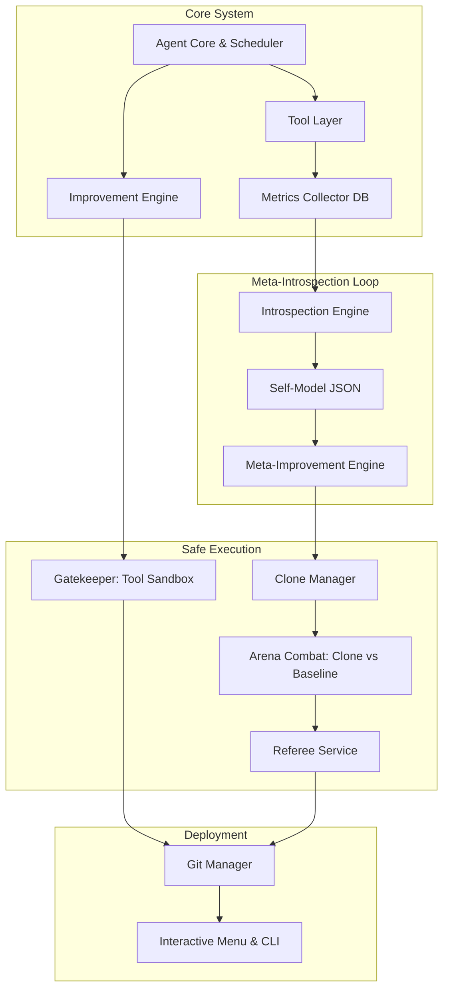

# ARIA — Autonomous Recursive Improvement Agent

> A fully autonomous, recursively self-improving AI system. ARIA monitors its own tools, detects weaknesses, generates better code via LLMs, validates it in isolated Docker sandboxes, and deploys improvements automatically. With Phase 7, ARIA can now even introspect its own internal architecture and rewrite its own framework code safely.

---

## 🏗️ Architecture



---

## 🚀 Quick Start

### 1. Prerequisites

- Python 3.11+
- Docker Desktop (must be running)
- A [Groq API key](https://console.groq.com) (free tier available)

### 2. Install Dependencies

```bash
pip install -r requirements.txt
```

### 3. Configure Environment

```bash
cp .env.example .env
# Edit .env and set your GROQ_API_KEY
```

### 4. Launch ARIA

```bash
python -m aria run
```

---

## 💻 CLI Commands

| Command | Description |
|---|---|
| `python -m aria run` | Launch the Interactive Command Center (Menu) |
| `python -m aria status` | Print current tool metrics table |
| `python -m aria improve --tool search_tool` | Manually trigger improvement for a specific tool |
| `python -m aria rollback --tool search_tool` | Revert a tool to its last Git version |
| `python -m aria run-tool --tool <name>` | Execute a tool directly from CLI |
| `python -m aria history` | Show all improvement history |

---

## 🧠 Recursive Meta-Improvement (Phase 7)

Unlike traditional agents, ARIA doesn't just improve its tools—it improves **itself**. 

1. **Self-Modeling:** ARIA continually analyzes the performance traces of its tools to detect abstract, system-wide weaknesses and architectural bottlenecks, saving them to `self_model.json`.
2. **Framework Modification:** The Meta-Improvement engine can propose rewrites to ARIA's own core code (e.g., prompt templates, candidate generation logic, weakness detection, UI, and schedulers).
3. **Isolated Clones:** To prevent catastrophic failure, ARIA spins up a fully isolated Docker copy of itself (a "Clone") and injects the architectural change.
4. **Arena Combat:** The Clone and the Current ARIA are pitted against each other in a benchmark evaluation. 
5. **The Referee:** An objective Referee scores the combat report based on correctness, latency, robustness, and safety. The clone is immediately discarded if it does not mathematically beat the baseline ARIA.

*Note: ARIA is strictly forbidden from modifying its own Gatekeeper, metrics schema, API keys, or the Meta-Loop itself (The Constitution).*

---

## 🛡️ Safety Model

ARIA executes untrusted, AI-generated code. It relies on a 7-layer defense system:

1. **Rate Limiting** — Strict rate limits on both tool improvements (max 5/hour) and meta-improvements (max 1/day).
2. **Groq Rate Limiter** — Sliding window prevents HTTP 429 errors.
3. **Static AST Analysis** — Blocks forbidden imports (`os`, `sys`, `subprocess`) to prevent OS-level backdoors before code ever runs.
4. **Docker Sandbox** — Isolated containers without network access (for math/code) or with strict timeouts (for web tools) that enforce a 100% test-pass rate.
5. **Hallucination Protection** — The sandbox actively catches and rejects hallucinated arguments or non-deterministic test cases.
6. **Fitness Gate** — New code is scored via a weighted fitness function (Pass Rate, Latency, Tokens, Memory). It must objectively outperform the old code.
7. **Git Rollback** — Every single deployment is automatically committed to Git. If system health degrades, ARIA rolls back the code.

---

## 🛠️ Improvable Tools

| Tool | Description | Improvable |
|---|---|---|
| `search_tool` | DuckDuckGo web search with HTML fallback | ✅ |
| `summarizer_tool` | LLM + extractive text summarization | ✅ |
| `calculator_tool` | Safe AST-based math evaluator | ✅ |
| `file_reader_tool` | Allowlisted file reading with path traversal protection | ✅ |
| `code_executor_tool` | Python snippet execution via Docker | ✅ |
| `weather_tool` | Open-Meteo weather (free, no auth) | ✅ |

---

## ⚙️ Configuration (`.env`)

| Variable | Default | Description |
|---|---|---|
| `GROQ_API_KEY` | required | Your Groq API key |
| `GROQ_MODEL` | `llama3-8b-8192` | Groq model to use |
| `REQUIRE_HUMAN_REVIEW` | `true` | Gate meta-improvements behind human review |
| `SUCCESS_RATE_THRESHOLD` | `0.70` | Flag tools below this success rate |
| `LATENCY_THRESHOLD_SECONDS` | `5.0` | Flag tools above this p90 latency |
| `MAX_IMPROVEMENT_CYCLES_PER_HOUR`| `5` | Safety cycle rate limit |
| `SANDBOX_TIMEOUT_SECONDS` | `120` | Docker container execution timeout |
| `META_INTROSPECTION_INTERVAL` | `10` | Cycles between meta-introspection runs |
| `FITNESS_THRESHOLD` | `0.5` | Minimum fitness score required |

---

## 📂 Project Structure

```
ARIA/
├── aria/
│   ├── core/           Agent Core, Scheduler, Fitness Scoring
│   ├── tools/          6 improvable tools + registry + base class
│   ├── metrics/        SQLite DB schema + collector
│   ├── introspection/  Clone Manager, Meta-Loop, Self-Model
│   ├── improvement/    LLM prompt builder + improvement engine
│   ├── gatekeeper/     Static validator, Docker sandbox, Referee
│   ├── versioning/     Git manager
│   └── ui/             Interactive monochromatic CLI menu
├── .env.example        Configuration template
├── Dockerfile.sandbox  Docker image for tool validation
├── requirements.txt    Python dependencies
└── README.md
```

---

## 📄 License

MIT — Educational and experimental use.
