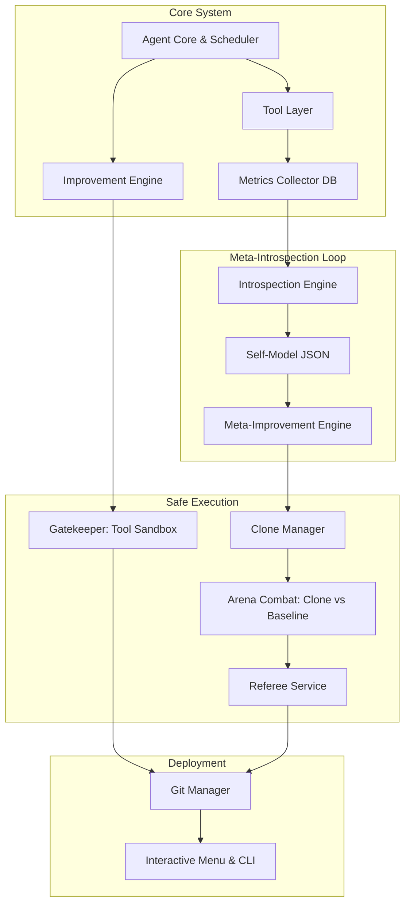

# ARIA — Autonomous Recursive Improvement Agent: Technical Architecture

ARIA is an advanced, autonomous AI system that not only executes tools but continuously monitors, evaluates, and improves its own capabilities and internal architectural frameworks. This document provides an exhaustive, deeply detailed technical breakdown of ARIA's internal architecture, execution workflows, safety models, and subsystem mechanics.

---

## 1. Introduction and High-Level Overview

### 1.1 The Philosophy of Recursive Meta-Improvement
Unlike traditional LLM-based agents that execute static tools, ARIA treats its own codebase as a mutable environment. The system functions on two distinct tiers of improvement:
1. **Tool-Level Improvement**: Observing individual tool execution (e.g., search functions, code executors), identifying edge cases, and generating superior tool implementations.
2. **Tool Synthesis (Self-Expansion)**: Generating entirely new tools on-the-fly from human-provided natural language specifications, expanding the agent's capability bounds.
3. **Meta-Level Improvement**: Observing system-wide architectural bottlenecks (e.g., poor prompt generation, flawed scheduling), mapping them to a self-model, and rewriting ARIA's own core orchestration code.

### 1.2 High-Level System Architecture Diagram



---

## 2. Core Subsystems Breakdown

### 2.1 Agent Core & Scheduler (`aria/core`)
The **Agent Core** (`agent.py`) is the central brain of ARIA. It manages event queues, rate limits, orchestrates execution cycles, and publishes status updates to the TUI (Terminal User Interface).

- **Event Queue System**: Decouples the UI from execution by publishing `AgentEvent` objects (e.g., `CYCLE_STARTED`, `SANDBOX_VALIDATION`, `ROLLED_BACK`) to a thread-safe queue.
- **Cycle Rate Limiter**: Enforces strict caps on improvement attempts (e.g., max 5 improvements per hour) independent of external API rate limits.
- **Execution Orchestration**: The `run_improvement_cycle()` method triggers the end-to-end pipeline: Introspection -> Generation -> Arena Validation -> Review/Deploy.
- **Post-Deployment Monitoring**: A background process that checks the health of deployed improvements. If a tool's success rate regressions are detected post-deployment, the Agent Core automatically rolls the codebase back to the prior stable Git tag.

### 2.2 Metrics Collector and Tracing (`aria/metrics`)
All tool executions are heavily monitored and logged to an internal SQLite database (`aria.db`).

- **Tool Stats**: Tracks execution latency, memory footprint, token usage, and pass/fail success rates.
- **Cycle Traces**: Records the entire lifespan of an improvement cycle, logging prompts sent to the LLM, the raw generated code, test outcomes, and final deployment status.
- **Review Queue**: Stores generated improvements that passed tests but require manual human authorization before Git deployment.

### 2.3 Introspection Engine (`aria/introspection`)
The Introspection Engine bridges the gap between historical metrics and actionable improvements.

- **Weakness Detection (WTDS & OWS)**: Analyzes SQLite traces to compute the **Weighted Temporal Degradation Score (WTDS)**. This is a mathematically rigorous algorithm evaluating a tool's Current Health, Trajectory, Fix Resistance, and System Impact.
- **Subjective Timeline & Opportunity-Weighted Stagnation (OWS)**: Replaces naive wall-clock recency. ARIA maintains a "Subjective Timeline" inside `tool_stagnation`. If a tool mathematically qualifies for an upgrade (WTDS >= 0.20) but loses the priority bid to a worse tool, its `times_bypassed` integer increments. OWS dynamically accelerates priority for highly neglected tools, while resetting stagnation only upon cycle completion. This successfully neutralizes the "Monoculture Exploit."
- **The Self-Model (`self_model.json`)**: During a Meta-Introspection cycle, an LLM parses hundreds of cycle traces to build a structural understanding of ARIA's flaws. This is persisted to `self_model.json`, which tracks "known_weaknesses" and "failure_patterns" per core component (e.g., `improvement_engine`, `gatekeeper`).
- **Clone Lifecycle**: When a meta-improvement is triggered, ARIA cannot safely alter its live state. Instead, the `clone_manager` duplicates the entire ARIA repository into a temporary directory, applies the architectural change to the clone, and executes an Arena Combat evaluation.

### 2.4 Evolutionary Engine (`aria/evolution` & `aria/improvement`)
Responsible for reading weaknesses and generating candidate code via LLMs (Groq). It replaces the legacy single-pass generation with a multi-strategy evolutionary pipeline.

- **Multi-Strategy Generation**: ARIA generates a diverse pool of candidate improvements using distinct strategies:
  - **Mutation**: Targeted, microscopic edits to specific logic branches.
  - **Breeding (Crossover)**: Combines abstract syntax tree (AST) traits from two different, historically successful tools.
  - **Structure-Guided**: Forces the LLM to follow a specific structural template for the code rewrite.
  - **Zero-Shot**: A full rewrite from scratch.
- **Parallel Candidate Arena**: Candidates are dispatched to isolated Docker sandboxes and evaluated concurrently. The `CandidateArena` orchestrates these parallel evaluations, scores them, and identifies the ultimate winner to face the baseline.
- **Adversarial Test Generation**: Before code is written, ARIA generates a suite of "Tier 3" adversarial test cases designed specifically to exploit the identified weakness. These tests are cryptographically signed to prevent the newly generated tool code from altering the tests.

---

## 3. The 7-Layer Defense System (Gatekeeper)

The **Gatekeeper** (`aria/gatekeeper`) is ARIA's immune system. Because ARIA executes untrusted, AI-generated Python code, strict isolation is paramount.

### Layer 1: Rate Limiting
Strict limits are placed on improvement frequency to prevent recursive runaway loops (e.g., 5 tool cycles/hour, 1 meta cycle/day).

### Layer 2: Static AST Analysis
Before executing any generated code, the static validator (`validator.py`) parses the Abstract Syntax Tree (AST) of the candidate source. It enforces:
- A strict whitelist of permitted imports.
- Blocked modules: `os`, `sys`, `subprocess`, `shutil` — preventing OS-level backdoors.

### Layer 3: Docker Sandbox Isolation
The candidate code is packaged with its adversarial test suite and executed inside a fully isolated Docker container (`python:3.11-slim`) using `asyncio.create_subprocess_exec` to prevent thread exhaustion during high-concurrency arena combat.
- **Network Isolation**: The container has zero network access. External APIs are strictly mocked.
- **The `mock_apis` Framework**: To prevent LLMs from hardcoding fake responses inside their production `run()` logic to cheat the sandbox, new tools must implement a `mock_apis(self, respx_mock)` hook. The Sandbox runner injects a `respx` router into this hook to mock API endpoints statically before executing the tests.
- **Resource Limits**: Strict memory limits (e.g., 256MB) and CPU quotas prevent malicious or accidental infinite loops.

### Layer 4: Cryptographically Signed Tests
The adversarial test cases generated by ARIA are signed using HMAC-SHA256 (`session_token`). When injected into the Docker sandbox, the runner verifies this signature. This guarantees the LLM hasn't hallucinated easy test cases to artificially pass validation.

### Layer 5: Parallel Arena Combat (Evolutionary Pool vs. Baseline)
The new code is evaluated, but that is not enough. ARIA evaluates an entire pool of multi-strategy candidates (mutants, cross-breeds, etc.) simultaneously in the `CandidateArena`. The best-performing candidate from this pool is then selected as the "Clone" to challenge the *current* version of the tool (Baseline) against the *exact same* adversarial test suite.

### Layer 6: The Referee Protocol & Fitness Gate
A specialized **Referee Service** (`referee`) runs outside the container. It receives the JSON results of both the Baseline and the Clone.
- It computes a weighted **Fitness Score**: `(Pass Rate * Weight) - (Latency * Weight) - (Memory * Weight) - (Tokens * Weight)`
- **The Rule**: The Clone must mathematically outscore the Baseline by a predefined delta. If it does not perform strictly better, or if it hallucinates, the Clone is ruthlessly discarded.

### Layer 7: Git Rollback Integration
Every successful deployment is committed to Git with auto-generated tags (`pre_improvement_X`, `post_improvement_X`). If post-deployment monitoring flags a regression, the system executes an automated `git checkout` to restore stability.

---

## 4. Execution Flow: The Meta-Improvement Loop

A standard tool improvement cycle flows precisely as follows:

1. **Trigger**: Scheduler triggers a cycle based on time or user CLI request.
2. **Introspect**: `IntrospectionEngine` queries `aria.db` to locate the tool with the lowest success rate.
3. **Adversarial Synthesis**: Generates edge-case tests targeting the tool's weaknesses, signing them securely.
4. **Evolutionary Generation**: Groq LLM generates multiple candidate tools (`candidate_1`, `candidate_2`, etc.) using diverse strategies (Mutation, Breeding, Zero-Shot).
5. **Static Check**: Validator ensures no malicious imports exist in any candidate tool.
6. **Parallel Sandbox (Arena)**: The candidate pool is evaluated concurrently in Docker against the signed adversarial tests. The best candidate becomes the "Clone".
7. **Sandbox (Baseline)**: Current tool runs against the adversarial tests in Docker.
8. **Combat Evaluation**: The Referee compares outputs. If `Clone_Score > Baseline_Score`, proceed.
9. **Human Review Gate**: If `REQUIRE_HUMAN_REVIEW=true`, the code enters a pending state in the database.
10. **Deploy**: Code is written to the host filesystem. Git commits the change. The tool registry is hot-reloaded.

### 4.1 Meta-Introspection Flow (Architectural Changes)
If the cycle targets ARIA itself:
1. `meta.py` generates a clone of the entire repo.
2. LLM proposes an architectural shift (e.g., rewriting `aria/core/scheduler.py`).
3. Change applied to the clone.
4. Clone spins up and executes an internal improvement cycle as a benchmark.
5. If the clone successfully improves a benchmark tool faster/better than the host ARIA, the clone's architectural change is extracted and deployed to the host.

### 4.2 Tool Synthesis Flow (Self-Expansion)
When ARIA encounters a task it lacks the capability for, the `synthesize` engine engages:
1. **Specification Phase**: User provides a natural language specification (e.g., "Fetch real-time Bitcoin prices via Coingecko").
2. **Generation**: The LLM synthesizes a brand-new subclass of `BaseTool`, implementing production code in `run()` and mock HTTP responses via `mock_apis()`.
3. **Dual-Key Orchestration**: Because synthesis requires large generation windows, ARIA routes synthesis prompts through a dedicated `SYNTHESIS_GROQ_API_KEY` to protect the primary orchestration key from rate-limiting.
4. **Sandbox Verification**: The synthesized tool runs its own `test_cases()` inside the isolated Docker sandbox without baseline comparison (since no baseline exists).
5. **Deployment**: If tests pass without network leaks or structure violations, the tool is permanently saved to `aria/tools/` and instantly becomes available in the registry for future execution.

---

## 5. Tool Architecture

Tools in ARIA extend `BaseTool` (`aria/tools/base.py`). 

```python
class BaseTool:
    @property
    def name(self) -> str: ...
    @property
    def description(self) -> str: ...
    def run(self, input_data: dict) -> ToolResult: ...
    def test_cases(self) -> list[TestCase]: ...
```

Tools carry their own self-validating `test_cases()`. This forces the LLM to write tests whenever it modifies a tool, ensuring high test coverage and protecting against regressions during future iterations.

### 5.1 Natural Language Processing Integration
To expand capability beyond raw API wrappers, ARIA incorporates specialized LLM extraction (via Groq API) directly into individual tools before their core logic executes.
- **Example: Calculator Tool:** Evaluates raw math safely via `_safe_eval()`. For complex inputs (e.g., word problems like *"If I had 40 elephants and you had 30... How can we get 100?"*), it first uses a strict, zero-temperature LLM prompt requesting a JSON payload. The LLM extracts the exact mathematical formula needed (bypassing algebraic equations) and flags if the user is asking a delta/target question. The system then evaluates the math safely and dynamically formats the result (e.g., `+30.0` or `-10.0`) based on the delta flag. This marries the safety of AST evaluation with the flexibility of NLP.

---

---

## 6. The Memory Subsystem (Long-Term Retention & Analytics)

ARIA possesses a highly sophisticated memory architecture (`aria/memory`) designed to retain knowledge across agent restarts and thousands of improvement cycles. Instead of starting from scratch every run, ARIA recalls past mistakes and proven fixes to accelerate learning.

### 6.1 Failure History & Improvement Tracking
- **`failure_history`**: Every time a tool fails, ARIA logs the traceback, error message, and context.
- **`improvement_history`**: Logs every generated fix, whether it succeeded or failed, and its "Fitness Delta".

### 6.2 Intelligent Retrieval (Semantic & Execution Context)
When an improvement cycle begins, ARIA queries its memory using:
1. **Traceback Signatures**: Exact matches to identical stack traces.
2. **Semantic Similarity**: Fuzzy matching of error messages using rapid NLP techniques.
3. **Cross-Pollination**: If `weather_tool` fails with a `KeyError`, ARIA can recall a successful fix for a `KeyError` in `calculator_tool` and apply the same logic.

### 6.3 Memory Compression & Clustering
To prevent the database from growing unbounded with duplicate errors:
- **`failure_patterns`**: A background compression engine (`compression.py`) continually scans the database, clustering identical failure signatures into unified "patterns".
- **Temporal Regression Detection**: If ARIA deploys a fix for a pattern, it is marked as `resolved`. If the exact error occurs again *after* the deployment timestamp, ARIA detects the regression and automatically degrades the pattern back to `active`.

### 6.4 Memory Ranking
Not all memories are equally valuable. ARIA dynamically ranks historical context using a weighted scoring algorithm (`memory_score`):
- **Reliability (40%)**: How many subsequent improvement cycles successfully reused this fix?
- **Frequency (30%)**: How often does this error actually happen in production? (Logarithmic scaling).
- **Recency (30%)**: Is this memory from yesterday, or three months ago? (Exponential decay half-life).

### 6.5 Memory Dashboard & Analytics
The CLI and TUI provide real-time analytics into ARIA's brain:
- **Pain Score**: ARIA mathematically computes the "worst tool" in the system by multiplying its failure count by an unreliability penalty (tools whose fixes don't survive get penalized).
- **Commands**: Accessible via `python -m aria memory`, including `--failures`, `--fixes`, `--worst-tool`, and `--reliability`.

---

## 7. The Root Cause Analysis Subsystem (Phase 2)

Built on top of the Memory Subsystem, the Root Cause Analysis module (`aria/rootcause`) aggregates raw stack traces and isolated tool metrics into high-level systemic diagnoses.

### 7.1 Taxonomy and Classification
Instead of treating every exception as a unique event, ARIA maps failures into a fixed taxonomy (e.g., `Network`, `Authentication`, `Logic Error`, `Timeout`).
- **Heuristic Classification**: Fast, regex-based matching for common exceptions (e.g., matching `TimeoutError` to `Timeout`).
- **LLM Classification**: Complex or ambiguous tracebacks are sent to Groq for classification, bounded by a strict rate limit (`MAX_ROOTCAUSE_LLM_CALLS_PER_CYCLE`) to prevent runaway API costs on unclassified traces.

### 7.2 Failure Clustering & Pattern Extraction
ARIA continuously scans classified failure patterns to find overlapping vectors:
- **`root_cause_clusters`**: Groups identical failure categories that occur close together or exhibit high frequency.
- **`architectural_patterns`**: The LLM analyzes the raw error context of a cluster and synthesizes human-readable systemic flaws (e.g., "The weather tool and search tool both lack timeout retries, leading to systemic brittleness").

### 7.3 The Hypothesis Pipeline
When an architectural pattern is extracted, ARIA generates a **Hypothesis** (`aria.rootcause.hypotheses.generate_hypotheses`).
- A hypothesis is an actionable proposal to fix the systemic flaw.
- **Hijacking the Scheduler**: If a hypothesis scores a high enough confidence, the `select_next_target()` logic bypasses the default "worst-performing tool" selection and instead triggers an improvement cycle targeting the tools involved in the hypothesis.
- **The `## DIRECTIVE`**: The Introspection Engine explicitly injects the proposed hypothesis into the Groq improvement prompt, commanding the LLM to implement the specific architectural fix.

### 7.4 Root Cause Synthesis (The `why` Command)
ARIA synthesizes all layers of the root cause module—from basic category breakdowns to active architectural patterns and hypothesis attempt counts—into a unified data structure.
- Accessible via the CLI (`python -m aria why`).
- Injected natively into the Meta-Introspection loop (`self_model.json`), allowing ARIA to explicitly state its own systemic flaws when analyzing its internal health.

---

## 8. The Knowledge Subsystem (Phase 3)

ARIA's Knowledge Subsystem (`aria/knowledge`) elevates isolated fixes into generalized, system-wide engineering principles. It allows ARIA to formulate its own programming constitution dynamically over time based on actual deployment outcomes.

### 8.1 Extraction & Confidence Scoring
- **Rule Extraction**: Analyzes durable fixes from the `improvement_history` to deduce underlying principles (e.g., "Always use parameter bindings instead of string formatting for SQL").
- **Initial Confidence**: Extracted rules are initialized with a mathematically bounded confidence score reflecting the density of evidence.
- **Dynamic Confidence Updates**: As a rule is injected into subsequent LLM prompts, ARIA tracks if the resulting improvements succeed or fail. The rule's confidence is dynamically updated based on these real-world outcomes.

### 8.2 Consolidation Mechanics
As ARIA extracts knowledge independently across hundreds of cycles, redundancies are managed autonomously:
- **Pruning**: Candidate rules that fail repeatedly or remain stagnant without successful applications are pruned (marked as `deprecated`).
- **Semantic Merging**: A background process scans for duplicated concepts using TF-IDF and fuzzy string matching. Equivalent rules are clustered into disjoint sets (Union-Find) and collapsed into a single, highly confident "winner".
- **Rule Refinement**: Rules that exhibit mixed outcomes (e.g., ~50% success rate) are not discarded. Instead, an LLM analyzes the differing contexts and refines the rule by narrowing its scope (e.g., from "Cache all queries" to "Cache only idempotent queries").

### 8.3 Proactive Knowledge Generation
Instead of strictly waiting for a bug to be patched before forming a rule, ARIA analyzes overarching architectural patterns extracted during Phase 2. If a systemic flaw is identified across the platform, ARIA proactively generates preemptive rules to stop the pattern from appearing in future tools.

### 8.4 Integration with the Improvement Engine
The `active` rules are serialized deterministically to `engineering_rules.json` (and committed to Git) and are injected directly into the system prompts of the Improvement Engine (`prompts.py`). This guarantees that ARIA adheres to its hard-earned principles whenever generating new tool implementations.

## 9. The Prediction & Meta-Evaluation Subsystem (Phase 5)

As ARIA scales, relying purely on heuristics and sandbox test passes is insufficient. The Prediction Subsystem (`aria/predictors`) introduces machine learning models to probabilistically estimate outcomes before spending expensive compute or deploying risky code.

### 9.1 Predictive Gates
ARIA employs three specialized ML models that act as intelligent firewalls throughout the improvement cycle:
- **Viability Predictor (`failure`)**: Evaluates a generated hypothesis (Phase 2) alongside historical tool data to predict if attempting a cycle will just lead to an immediate failure/abort. If predicted probability of failure is too high, the cycle is aborted early to save compute.
- **Success Predictor (`success`)**: Evaluates the generated candidate code (AST metrics, rule compliance score, complexity) to predict if it will ultimately succeed in production. Candidates with low predicted success are filtered out before entering the expensive Docker sandbox phase.
- **Risk Predictor (`risk`)**: Evaluates the winning candidate just before Git deployment. If it predicts a high probability of causing a post-deployment rollback, ARIA emits a loud warning in the UI (but currently relies on human-in-the-loop for the final veto).

### 9.2 Feature Engineering & Datasets
The prediction layer relies on rich, domain-specific features extracted from ARIA's SQL databases:
- **Cycle Features**: Tool failure rates, consecutive failed cycles, days since last deployment.
- **Candidate Features**: Source lines of code, cyclomatic complexity, AST-derived metrics (retry logic, exception scopes).
- **Meta Features**: Rule compliance scores from Phase 3, hypothesis confidence from Phase 2.
Datasets are generated deterministically (`build_candidate_dataset`, `build_failure_dataset`) by mapping historical metrics to ground-truth outcomes (e.g., `sandbox_passed AND ih.result == 'deployed'`).

### 9.3 Training and Promotion Lifecycle
ARIA autonomously trains predictors using `scikit-learn` pipelines (e.g., GradientBoosting, LogisticRegression):
- Models are evaluated using Stratified K-Fold Cross Validation.
- Only models that clear strict `MIN_TEST_AUC` (0.65) and `MIN_TEST_ACCURACY` (0.60) thresholds are registered as `candidate` versions.
- Candidates must be explicitly promoted to `active` via the CLI (`python -m aria predictors --promote <id>`).

### 9.4 The Meta-Evaluation Loop
Models in production are continuously monitored for degradation:
- Every prediction made during a cycle is logged to `prediction_log` with `outcome='pending'`.
- Once the cycle concludes and real-world outcomes are known, the logs are updated via `resolve_prediction_outcomes()`.
- The `predictor_health_report` calculates actual production accuracy and calibration error (ECE). If a model's real-world accuracy drifts below its test baseline, an `accuracy_drift` alert is fired and logged directly into ARIA's `self_model.json`.

---

## 10. The Introspection & Self-Improvement Proposal Subsystem (Phase 6)

Phase 6 elevates ARIA from a system that logs metrics to one that actively diagnoses its own structural flaws and proposes concrete solutions. Instead of just reacting to tool failures, ARIA analyzes patterns in its own internal thoughts, execution strategies, and resource utilization to identify systemic bottlenecks.

### 10.1 Meta-Introspection Cycle & Findings
At regular intervals, the `meta.py` engine sweeps the database to synthesize specific structural findings:
- **Architectural Weaknesses**: System-wide bottlenecks like "Prediction models are decaying" or "Adversarial tests lack depth."
- **Recurring Mistakes**: LLM engineering mistakes that persist despite explicit instructions, signaling a flaw in the prompt builder or rule injection logic.
- **Ineffective Improvements**: Changes that pass tests and deploy successfully but fail to improve real-world success rates.
- **Token Waste**: Cycles that consume massive LLM contexts with negative ROI.
- **Bad Prompts**: Prompt structures mathematically correlated with high failure rates (e.g., ignoring strategy directives).

### 10.2 The Self-Model Time Series
All findings are snapshotted into `self_model_snapshots`. This creates a measurable time series, allowing ARIA to determine if its active weaknesses are "improving", "stable", or "declining". The state is exported to `self_model.json` and committed to Git, making ARIA's internal health visible across restarts.

### 10.3 Proposal Generation & Lifecycle
Unlike tool-level fixes which are deployed automatically, Phase 6 generates **Self-Improvement Proposals** that are strictly human-in-the-loop:
- **Generation**: ARIA uses heuristics (for known failure modes) and LLM logic (for complex findings) to formulate concrete proposals. A proposal details exactly *what* to change (e.g., `aria/improvement/prompt_builder.py`), *why*, and defines a falsifiable `success_metric`.
- **Review & Acceptance**: Humans review proposals (`aria reflect --proposals`) and manually implement the changes.
- **Evaluation**: Once implemented, ARIA tracks the `success_metric` over a defined cycle window. It then automatically grades the proposal as a `success`, `failure`, or `inconclusive`. This closes the loop, as failed proposals feed back into the system as new findings to analyze.

---

## 11. Summary

ARIA represents a paradigm shift in agent design. By treating the agent framework itself as a fluid, optimizable construct, and surrounding that mutability with extreme, mathematically grounded safety constraints (Gatekeeper, Docker Sandboxing, Git Rollbacks, Long-Term Memory Compression, and the Knowledge Subsystem), ARIA achieves safe, persistent, autonomous self-evolution.
